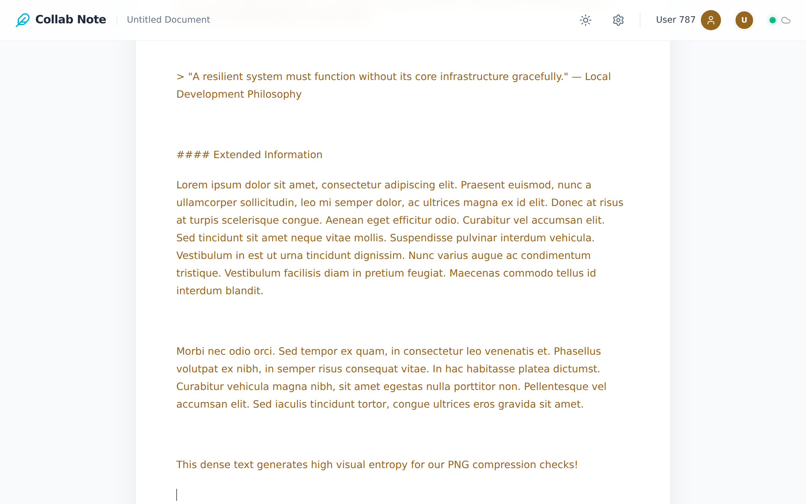
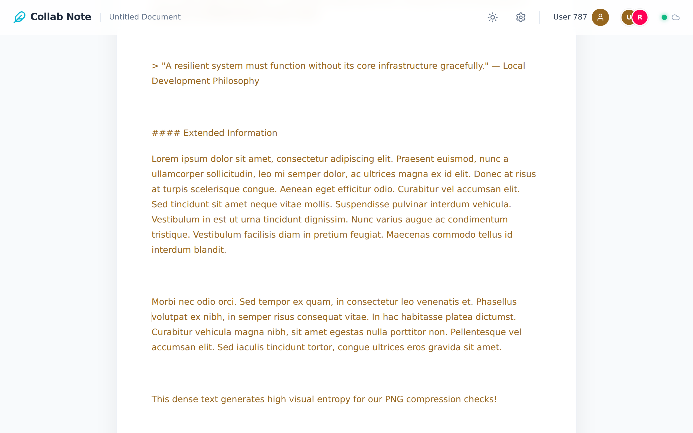
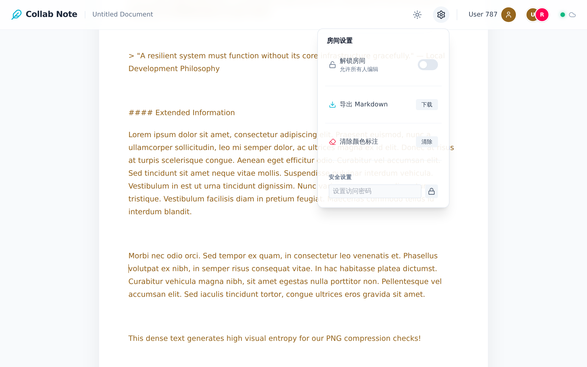

# Collab-Note

*Collab-Note is a real-time collaborative document editing application designed for fast, local-first multi-user writing sessions.*

Collab-Note 是一款支持多用户协作的文档编辑应用。它基于 Tiptap 提供了富文本编辑器，并内置了文档状态同步的网络通信机制。

## 项目特征 (Project Characteristics)
- **本地开发化 (Local Development)**：本地测试无需强制注册云端账号或配置外部数据库。
- **状态序列化 (State Serialization)**：文本编辑状态管理基于 Yjs 的无冲突复制数据类型 (CRDTs) 驱动。
- **技术栈与降级机制 (Tech Stack & Execution Fallback)**：基于 Vue 3、Vite 和 Tailwind CSS 构建。当检测不到云端连接变量时，系统会自动启用本地离线降级方案。

## 架构状态 (已实现与规划中)

### 已实现 (Implemented)
- **前端视图层 (Frontend View Layer)**：使用 Vue 3 `<script setup>` 组合式 API 构建，由 TailwindCSS 提供样式支持。
- **富文本引擎 (Rich-text Engine)**：Tiptap 编辑器引擎，挂载了光标追踪与文档协作的提供者绑定。
- **状态同步 (State Synchronization)**：基于 Yjs 的 CRDT 模型，通过 `y-webrtc` 作为本地信令回退协议。
- **离线/开发模式运行 (Offline / Dev-mode execution)**：系统检测到缺少云端配置（`VITE_SUPABASE_URL`）时，会自动降级采用本地 WebRTC P2P 网状架构以支持离线/局域网执行。

### 规划中 (Planned)
- **云端持久化 (Cloud Persistence)**：集成 Supabase PostgreSQL，利用 `y-supabase` 将文档数据持久化存储至数据库。
- **安全与认证加固 (Hardened Security & Authentication)**：将现有的模拟锁定机制迁移为严格的数据库行级安全 (RLS) 策略。
- **可扩展实时边缘 (Scalable Realtime Edge)**：生产环境中将从本地单节点的 `y-webrtc` 代理切换为受托管的可扩展 WebSocket 后端。

## 快速启动 (本地运行路径)

在无云端依赖的情况下启动本地开发环境：

1. **安装依赖**
   ```bash
   npm install
   ```

2. **启动本地信令服务器** (网络回退节点)
   重新开启一个新的终端窗口，运行以下命令建立 WebSocket 代理。
   ```bash
   npm run signaling
   ```
   > 该服务作为 P2P 代理运行于 `http://localhost:4444`。

3. **启动 Vue 3 前端服务器**
   ```bash
   npm run dev
   ```
   > 前端服务运行于 `http://localhost:5173`。在多个浏览器窗口或局域网设备中打开此链接即可进行实时协作。

## 功能验证 (本地执行)

### 1. 落地页 / 大厅入口 (Hero)
允许用户通过房间代号直接进入。本地回退模式下不强制要求身份验证。

*Authenticity*: URL: `http://localhost:5173/` | Timestamp: `2026-02-21T05:57:24.379Z` | Size: `4200991 bytes` | SHA-256: `4d8220d2680d5bcc5cffa1f012cb8d922ff51f79f2154d6ae499d8a4665ec3cf`

### 2. 主编辑器视图 (Main)
展示编辑器初始化状态及基础文档排版结构渲染。

*Authenticity*: URL: `http://localhost:5173/local-demo` | Timestamp: `2026-02-21T06:03:59.469Z` | Size: `264007 bytes` | SHA-256: `7b60ea3256fa48f8c540f4b630e79acd7c2b72f580508f35ab362471d3ff7486`

### 3. 多用户实时同步 (Flow)
呈现连接的本地节点间的多光标追踪以及 CRDT 文本状态同步能力。

*Authenticity*: URL: `http://localhost:5173/local-demo` | Timestamp: `2026-02-21T06:04:12.247Z` | Size: `265344 bytes` | SHA-256: `aada7f5b7241505a5d6695019f22c880f8c0ea34cfef08f02ccfa38809418e68`

### 4. 设置与配置弹窗 (Settings)
覆盖在房间内部视图之上的局部设置 UI 面板。

*Authenticity*: URL: `http://localhost:5173/local-demo` | Timestamp: `2026-02-21T06:04:13.486Z` | Size: `315771 bytes` | SHA-256: `1d16ab7e76f471402f113661cd115809b92f34cdcbc520fe3ccaf478508dde31`

---
*注：在此演示配置下，系统完全基于 P2P 网状架构运行。当所有挂载同一房间的浏览器标签页（Peer 节点）被彻底关闭时，当前文档的内存状态将被清除。*
