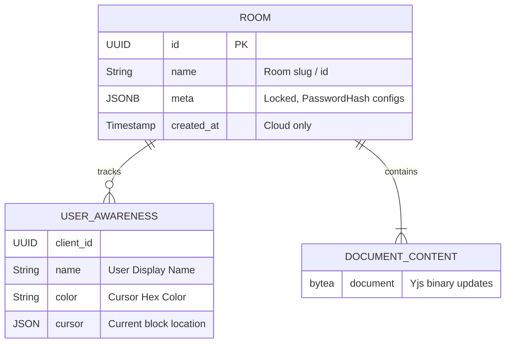

# Simplified Data Model

The data layer utilizes Yjs CRDT structures based on document-centric models. In the planned production environment, this Yjs state will persist within configured PostgreSQL tables. 

*Note: In the local `y-webrtc` fallback, `ROOM` and `DOCUMENT_CONTENT` exist entirely in browser memory/IndexedDB arrays mapped by room slug rather than SQL schema.*
