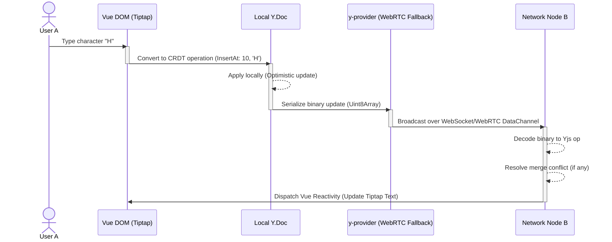

# Collaboration Edit Sync Path

This diagram maps a keystroke's event path from the Vue DOM through the Tiptap core, its conversion into a Yjs CRDT operation, and the subsequent binary serialization for over-the-wire broadcast.

