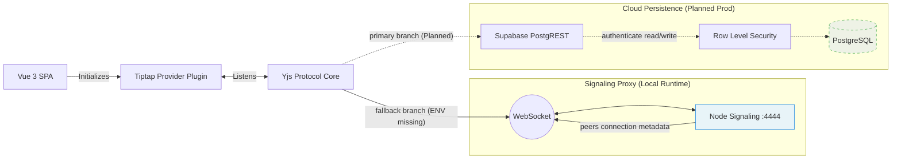

# API Relationship Map

This map documents the boundaries between the Vue client layer and the data routing infrastructures. The application utilizes a dynamic branch model: establishing local WebRTC tunnels via the Node signaling proxy when production endpoints are omitted.

