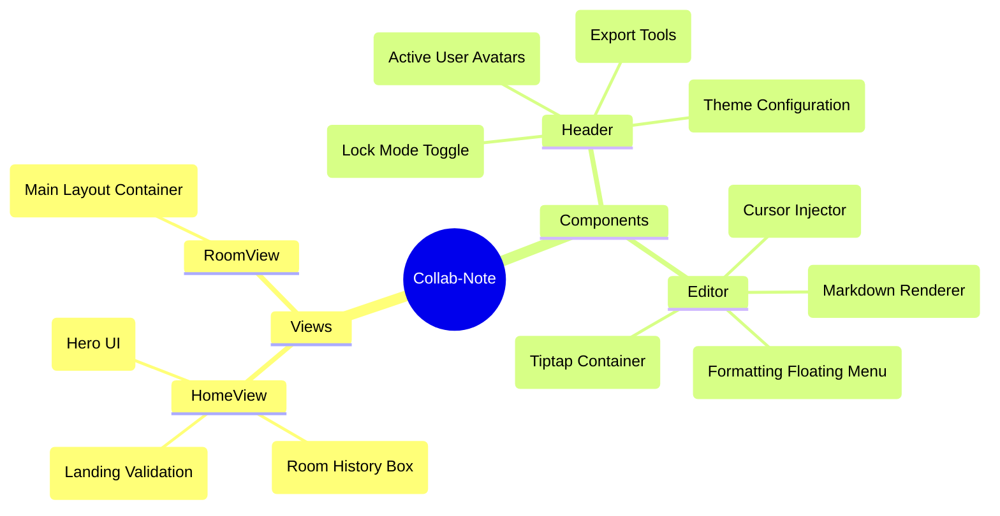

# Feature Module Map

A classification map structuring the core `<script setup>` Vue components that orchestrate the application's view paths.

```mermaid
mindmap
  root((Collab-Note))
    Views
      HomeView
        (Hero UI)
        (Room History Box)
        (Landing Validation)
      RoomView
        (Main Layout Container)
    Components
      Header
        (Lock Mode Toggle)
        (Active User Avatars)
        (Theme Configuration)
        (Export Tools)
      Editor
        (Tiptap Container)
        (Cursor Injector)
        (Markdown Renderer)
        (Formatting Floating Menu)
```
