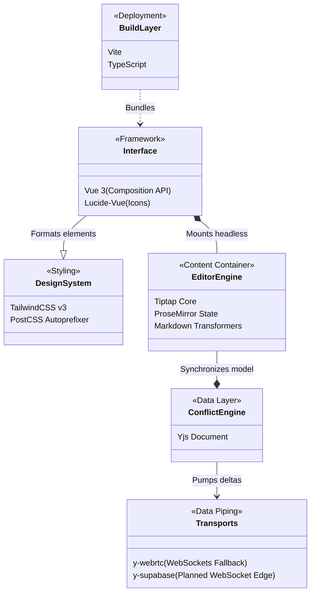

# Tech Stack Layered Diagram

This class diagram delegates structural responsibilities across the application's technology selections, distinctly mapping the UI frameworks, the CRDT engine, and the transport pipelines.

